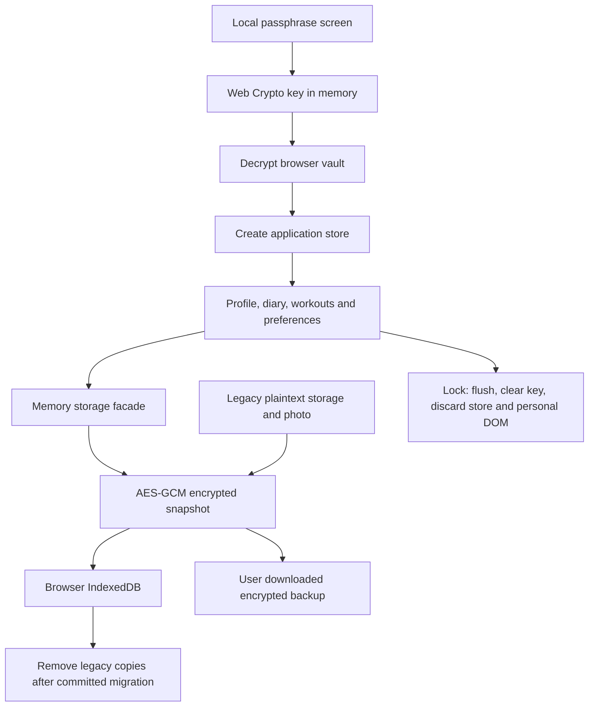

# Fitness-app privacy audit — 2026-10-09

Scope: `66050275-pun/fitness-app` only. Public Streamlit mobile preview, its frontend source, persistent data pipeline and Capacitor wrapper configuration. This is an implementation review and regression check, not an independent penetration test or a legal compliance certification.

## Application and data flow

NutriAI is a TypeScript/Vite nutrition and fitness tracker with a Capacitor Android wrapper. Streamlit builds the frontend and embeds static HTML/JavaScript/CSS in an iframe. Its Python code handles no personal form values. A central store owns navigation, profile, goals, diary, exercises and local demo conversations.

There is no application user database, login service, real food-recognition endpoint, connected health provider or remote coach in this build. Scanner and coach are local demonstrations. Clipboard copy and sharing are explicit user actions; feedback copy can include the email and description the user entered.

## Persistent information

| Data | Before | Now |
| --- | --- | --- |
| Lock-screen language choice (`en` / `th` only) | Not previously available | Non-sensitive `nutriai_ui_language` localStorage flag |
| Name, birth date, sex, height, current/target weight, weight goal, activity level | Plaintext localStorage | Encrypted vault |
| Onboarding answers and draft, nutrition targets, eating schedule, preferences, consent | Plaintext localStorage | Encrypted vault |
| Meal diary, custom foods, portions, water and burned calories by date | Plaintext localStorage | Encrypted vault |
| Workout history, weekly routines, scheduled workouts, records derived from history | Plaintext localStorage | Encrypted vault |
| Weight history, search history, dashboard layout and insight range | Plaintext localStorage | Encrypted vault |
| Feedback subject, description, contact email and diagnostics preference | Plaintext localStorage | Encrypted vault |
| Profile photo | Plaintext Blob in separate IndexedDB | Encrypted bytes in same vault |
| Coach conversation, active workout and unsaved modal/form input | In memory | In memory; discarded on lock |
| Downloaded backup | Plaintext JSON, omitted photo | Encrypted JSON, includes photo and saved drafts |

Only seven explicitly named legacy NutriAI localStorage keys and `nutriai_profile_db` are migrated/removed. Unrelated browser storage is not cleared. Backups already downloaded under an older version are outside the application's control and may still contain plaintext.

## Protection implemented

- Web Crypto AES-256-GCM with a fresh random 96-bit IV per snapshot and authenticated version context. Passphrase-derived keys use PBKDF2-HMAC-SHA-256, 600,000 iterations and a random 128-bit salt; keys are non-extractable and remain only in memory. Vault format version 1 fixes these parameters.
- A synchronous memory facade preserves existing state APIs; serialized asynchronous commits write only ciphertext. Storage success is reported after IndexedDB transaction completion. There is no plaintext fallback.
- Migration commits ciphertext before removing the legacy data and photo. A failed migration remains recoverable; existing encrypted records are never replaced by creating a new vault.
- Atomic comparison of the previous record during write prevents stale tabs from silently overwriting each other. Conflicts display a save error. The losing tab can export its current in-memory data as an encrypted backup even if saving failed; it must not blindly overwrite the other tab.
- Wrong passphrases and authentication failures leave stored records untouched. Locks wait for pending writes; failed writes leave a protected recovery screen instead of pretending the lock completed.
- Manual lock and five-minute inactivity lock discard the application store, revoke the profile object URL, stop workout timers, clear personal DOM and remove the in-memory key reference. Backgrounding immediately covers the screen; elapsed time is checked again on return because background timers can be throttled.
- User text is HTML escaped. Dynamic string arguments in inline event handlers are JSON encoded and then HTML escaped, including names/IDs containing quotes. Coach messages, meal labels, confirmation messages, legacy dates, photo URLs and custom food descriptions were covered.
- Google-hosted fonts and Unsplash demo images were replaced with bundled fonts and a local illustration. Production iframe CSP blocks fetch/WebSocket connections, frames, workers, form submissions and external image/font sources. Existing template event handlers still require `unsafe-inline`; this policy is a supplementary protection, not a replacement for escaping or a guarantee against hostile application code.
- Privacy/FAQ/coach text now distinguishes local demos, encrypted local records, public source code, network metadata and the limits of unlocked-device protection.

## Practical limits

- Browser data is scoped to an origin and browser profile. It does not synchronize between devices and may be lost when browser storage is cleared/evicted, private browsing ends, or the app URL changes. Keep a backup and the original passphrase separately.
- There is no password recovery. A weak passphrase can be guessed offline if someone obtains the vault. Use a unique long passphrase.
- The app and same-origin scripts can read decrypted information while unlocked. Device compromise, extensions, malicious updates and people using the unlocked browser are outside at-rest encryption's protection.
- Streamlit's surrounding page and the host still handle normal network requests and metadata. The inner iframe CSP does not control hosting-page analytics or provider logging.
- Browser persistence and mobile lifecycle behavior vary. The automated browser checks below use Chromium with a mobile viewport; physical iPhone/Android browsers and a built Android APK were not independently validated.
- The passphrase remains associated with the empty encrypted vault after “Delete All Local Data.” Downloaded backups and old exported files are not erased by deletion inside the app.
- Standard JavaScript cannot promise immediate zeroization of garbage-collected memory or prevention of screenshots. Locking removes live application references and personal DOM; it is not full-device security.

## Verification

- TypeScript type check and Vite production build.
- Existing header, planner and onboarding regressions updated for the private storage facade and safe handler arguments.
- Vault regression: locked access, minimum passphrase, migration with failed quota before commit, unrelated storage preservation, photo migration, ciphertext secrecy, fresh IVs, wrong password, tampering, stale tab conflict, quota failure, recovery export/restore, retry, deletion and reload.
- Chromium mobile viewport: migrate synthetic profile/feedback; no plaintext remnants; render every main screen and profile subpage; malicious coach/feedback text does not execute; manual and inactivity lock; incorrect/correct password; reload returns to lock screen; no external requests from the tested frontend flows.
- Actual Streamlit-generated srcdoc iframe: encrypted storage creation and lock/unlock operate inside the iframe; the Python wrapper completes without app exceptions.
- npm production dependency audit: no reported vulnerabilities at review time. Full development audit retains seven findings in Tailwind 3's build-time brace/selector parser chain; fixing those requires a separate Tailwind major-version migration. Builds here consume trusted repository source. No claim is made that all dependency or future security risks have been eliminated.

## Component inventory

The table below lists every screen/component source and its input controls. All persistent writes go through the store/private storage pipeline above; render-only modules do not independently send data to a server.

| Component | Role / controls |
| --- | --- |
| `src/components/BottomSheets/QuickAddBottomSheet.ts` | `renderQuickAddBottomSheet`; renders navigation, records, summaries or actions |
| `src/components/Fitness/MonthlyFitnessCalendar.ts` | `renderMonthlyFitnessCalendar`; renders navigation, records, summaries or actions |
| `src/components/Fitness/PlannerDateDetailModal.ts` | `renderPlannerDateDetailModal`; renders navigation, records, summaries or actions |
| `src/components/Fitness/TodaysWorkoutCard.ts` | `renderTodaysWorkoutCard`; renders navigation, records, summaries or actions |
| `src/components/Fitness/WeeklyProgramEditorModal.ts` | `renderWeeklyProgramEditorModal`; renders navigation, records, summaries or actions |
| `src/components/Modals/CustomFoodModal.ts` | `renderCustomFoodModal`; fields: `cf-name`, `cf-brand`, `cf-category`, `cf-barcode`, `cf-serving-desc`, `cf-serving-qty`, `cf-serving-unit`, `cf-serving-equiv`, `cf-serving-desc-opt`, `cf-protein`, `cf-carbs`, `cf-fat`, `cf-calories`, `cf-fiber`, `cf-sugar`, `cf-sodium`, `cf-vit-c`, `cf-vit-d`, `cf-calcium`, `cf-iron`, `cf-potassium`, `cf-magnesium`, `cf-new-portion-qty`, `cf-new-portion-unit`, `cf-new-portion-equiv` |
| `src/components/Modals/DeleteWorkoutModal.ts` | `renderDeleteWorkoutModal`; renders navigation, records, summaries or actions |
| `src/components/Modals/DiaryCalendarModal.ts` | `renderDiaryCalendarModal`; renders navigation, records, summaries or actions |
| `src/components/Modals/MealDetailModal.ts` | `renderMealDetailModal`; renders navigation, records, summaries or actions |
| `src/components/Modals/NutrientDetailModal.ts` | `renderNutrientDetailModal`; fields: `nutrient-modal-search` |
| `src/components/Modals/ProfileConfirmationModal.ts` | `renderProfileConfirmationModal`; fields: `confirm-typing-input` |
| `src/components/Modals/QuickActionModal.ts` | `renderQuickActionModal`; renders navigation, records, summaries or actions |
| `src/components/Modals/SetPortionModal.ts` | `renderSetPortionModal`; fields: `set-portion-qty-input`, `set-portion-unit-select`, `set-portion-date`, `set-portion-time` |
| `src/components/Modals/WeightEntryModal.ts` | `renderWeightEntryModal`; fields: `weight-entry-id`, `weight-input-value`, `weight-input-unit`, `weight-input-date`, `weight-input-time`, `weight-input-note` |
| `src/components/Navigation/AppHeader.ts` | `renderAppHeader`; renders navigation, records, summaries or actions |
| `src/components/Navigation/BottomNav.ts` | `renderBottomNav`; renders navigation, records, summaries or actions |
| `src/components/Nutrition/CalorieProgressRing.ts` | `renderCalorieProgressRing`; renders navigation, records, summaries or actions |
| `src/components/Profile/ProfileMenuRow.ts` | `renderProfileMenuRow`; renders navigation, records, summaries or actions |
| `src/components/Profile/ProfileMenuSection.ts` | `renderProfileMenuSection`; renders navigation, records, summaries or actions |
| `src/screens/AICoachScreen.ts` | `renderAICoachScreen`; fields: `chat-input` |
| `src/screens/DashboardScreen.ts` | `renderDashboardScreen`; renders navigation, records, summaries or actions |
| `src/screens/DiaryScreen.ts` | `renderDiaryScreen`; renders navigation, records, summaries or actions |
| `src/screens/FitnessScreen.ts` | `renderFitnessScreen`; renders navigation, records, summaries or actions |
| `src/screens/FoodResultScreen.ts` | `renderFoodResultScreen`; renders navigation, records, summaries or actions |
| `src/screens/FoodSearchScreen.ts` | `renderFoodSearchScreen`, `renderFoodDefinitionCard`; fields: `food-search-input` |
| `src/screens/InsightsScreen.ts` | `renderInsightsScreen`; renders navigation, records, summaries or actions |
| `src/screens/PersonalRecordDetailScreen.ts` | `renderPersonalRecordDetailScreen`; renders navigation, records, summaries or actions |
| `src/screens/ProfileScreen.ts` | `renderProfileScreen`; fields: `profile-photo-input` |
| `src/screens/QuickLogScreen.ts` | `renderQuickLogScreen`; fields: `ql-food-name`, `ql-quantity`, `ql-unit`, `ql-serving`, `ql-save-to-my-foods`, `ql-calories`, `ql-protein`, `ql-carbs`, `ql-fat`, `ql-date`, `ql-time` |
| `src/screens/ScannerScreen.ts` | `renderScannerScreen`; renders navigation, records, summaries or actions |
| `src/screens/WorkoutDetailScreen.ts` | `renderWorkoutDetailScreen`; renders navigation, records, summaries or actions |
| `src/screens/onboarding/OnboardingScreen.ts` | `getOnboardingGoalPreview`, `renderOnboardingScreen`; fields: `onboarding-name`, `onboarding-dob`, `onboarding-height-cm`, `onboarding-height-ft`, `onboarding-height-in`, `onboarding-current-weight`, `onboarding-target-weight`, `onboarding-photo-input` |
| `src/screens/profile/ActivityLevelScreen.ts` | `renderActivityLevelScreen`; renders navigation, records, summaries or actions |
| `src/screens/profile/AppSettingsScreen.ts` | `renderAppSettingsScreen`; fields: `app-language-select` |
| `src/screens/profile/DataPrivacyScreen.ts` | `renderDataPrivacyScreen`; renders navigation, records, summaries or actions |
| `src/screens/profile/EatingScheduleScreen.ts` | `renderEatingScheduleScreen`; fields: `eating-schedule-enabled`, `schedule-start-time`, `schedule-end-time` |
| `src/screens/profile/FeedbackScreen.ts` | `renderFeedbackScreen`; fields: `feedback-category-input`, `feedback-subject-input`, `feedback-description-input`, `feedback-email-input`, `feedback-diagnostics-input` |
| `src/screens/profile/HealthConnectionsScreen.ts` | `renderHealthConnectionsScreen`; renders navigation, records, summaries or actions |
| `src/screens/profile/HelpCenterScreen.ts` | `renderHelpCenterScreen`; fields: `faq-search-input` |
| `src/screens/profile/LegalDocumentScreen.ts` | `renderLegalDocumentScreen`; renders navigation, records, summaries or actions |
| `src/screens/profile/MarketingConsentScreen.ts` | `renderMarketingConsentScreen`; renders navigation, records, summaries or actions |
| `src/screens/profile/NutritionGoalsScreen.ts` | `renderNutritionGoalsScreen`; fields: `goal-calorie-input`, `goal-protein-input`, `goal-carbs-input`, `goal-fat-input`, `goal-water-input` |
| `src/screens/profile/PersonalInformationScreen.ts` | `renderPersonalInformationScreen`; fields: `profile-name-input`, `profile-dob-input`, `profile-height-cm`, `profile-height-ft`, `profile-height-in`, `profile-weight-input` |
| `src/screens/profile/WeightGoalScreen.ts` | `renderWeightGoalScreen`; fields: `weight-goal-type-input`, `weight-target-input`, `weight-target-date-input`, `weekly-rate-input` |
| `src/screens/profile/WeightHistoryScreen.ts` | `renderWeightHistoryScreen`; renders navigation, records, summaries or actions |
| `src/screens/profile/WhatsNewScreen.ts` | `renderWhatsNewScreen`; renders navigation, records, summaries or actions |

### State, services and calculations

| Module | Responsibility |
| --- | --- |
| `src/main.ts` | Screen routing, form capture, validation and explicit clipboard/download actions; starts the store only after unlock |
| `src/store/appState.ts` | Application state, persisted fields, workout timers and store disposal |
| `src/security/vaultUI.ts` | Create/unlock screen, save indicator, lock, background shield, recovery and backup restore |
| `src/services/privateStorage.ts` | Encryption, migration, transaction commit, concurrency, encrypted backup/restore |
| `src/services/storagePersistence.ts` | Versioned app schema, legacy migration and field sanitizers |
| `src/utils/profileImageStorage.ts` | File type/size validation, crop/compress to JPEG and encrypted photo persistence |
| `src/services/aiFoodAnalysisAdapter.ts` | Pure future response adapter; no network request |
| `src/utils/sanitize.ts` | HTML escaping and inline handler argument encoding |
| Other `src/utils/*Calculations.ts`, `dateUtils.ts`, `unitConversions.ts`, `safeNumbers.ts` | Local calculations, portions, units, dates and bounds; no network/storage layer |
| `src/data/*` | Bundled catalog, presets, references, demo data and explanatory text |
| `index.html`, `src/index.css`, `vite.config.ts` | UI shell, locally bundled styles/fonts and production network restrictions |
| `streamlit_app.py` | Build and inline static frontend only; no personal input widgets or user-data storage |
| `capacitor.config.ts`, `android/` | Native wrapper scaffold; HTTPS local scheme, Internet permission, no application backend configured |

### Exercise illustration update — 2026-10-10

`src/components/Fitness/ExerciseIllustration.ts` and `src/data/exerciseArtwork.ts` now render 52 locally bundled frames for 27 exercise names (26 distinct illustrations), covering all presets and catalog entries. The CC BY-SA 4.0 source credits and license are preserved under `docs/exercise-art/`. The setup, catalog and active session render data URLs, including in the Streamlit srcdoc iframe, without new external image requests. A browser review decoded all frames in all four presets and all ten catalog thumbnails, checked active-session images, and found no page errors or external requests. This adds a pinned asset package and approximately 1.7 MB to the uncompressed JavaScript bundle; initial loading on slow connections may take longer.

### 2026-10-10 — Workout muscle overview

Added `WorkoutMuscleMap` to workout setup, with original inline front/back SVG and a static exercise-to-muscle mapping. Highlights derive only from the local draft exercise names and update with additions/removals. No remote assets, API requests, analytics, or new storage are introduced. All dynamic exercise names are HTML escaped, including unknown-name notices. Red denotes listed movers/assistants, not measured activation or intensity; the UI explains the schematic limitation.

### 2026-10-10 — Navigation transitions and shared theme

- Added `ScreenTransitions` to coordinate navigation without retaining outgoing DOM or taking view-transition screenshots. Cached current-view markup, animations and navigation/scroll history are cleared on successful vault lock before the private screen is removed.
- Vault gate/status/shield and fitness artwork/muscle map now share light/dark design variables. Shield activation and lock content clearing remain immediate; encryption and storage behavior are unchanged.
- Back navigation returns workout detail views to Fitness, and supports setup/session back actions using the existing cancellation flow. Unsaved workout summaries remain until the explicit Save/Discard action.
- App and device Reduce Motion preferences disable page and CSS animations. Zoom, keyboard focus indicators, safe-area spacing and active-navigation semantics are supported.
- Verification: TypeScript/Vite production build; existing two Playwright privacy scenarios (mobile and actual Streamlit srcdoc); direct mobile/iframe checks of forward/back transitions, onboarding, hardware back, theme consistency, open-details preservation, reduced motion and lock/unlock. Only synthetic data was used. No external dependencies or new personal-data requests were added.

### 2026-10-10 — Consistent English and Thai

- Enabled both language choices and synchronized the interface, HTML language, encrypted app preference and passphrase-screen choice. Bundled translations cover navigation, onboarding, profile pages, food and nutrient views, fitness and muscle maps, dialogs, errors, dates and canned demo replies.
- User-entered text stays intact; canonical exercise IDs, food IDs, date keys, units used for calculations and stored numerical values are unchanged. Built-in food labels are translated only at display/search boundaries. There is no translation API or new personal-data network request.
- Only the non-sensitive two-value language flag is readable before unlocking. Private data remain encrypted. Unsaved-change protection checks the save-status enum, independently of displayed language. Language selection is disabled during vault opening, and status refreshes retain recovery controls.
- Verification: TypeScript/Vite production build; 121 mobile views/states across both languages; 16 checks in the actual Streamlit srcdoc, including language selection, red muscle highlights, lock/reload, localized password errors, safely escaped unchanged user text and the plaintext language flag. The frontend made no external requests and logged no runtime errors in these checks. Only synthetic data was used.

- Streamlit now fingerprints frontend sources (including translation JSON) and dependency files. Changed sources rebuild once, and the HTML cache uses the same signature so a previous language bundle is not reused. Unchanged dependencies and builds remain cached.
