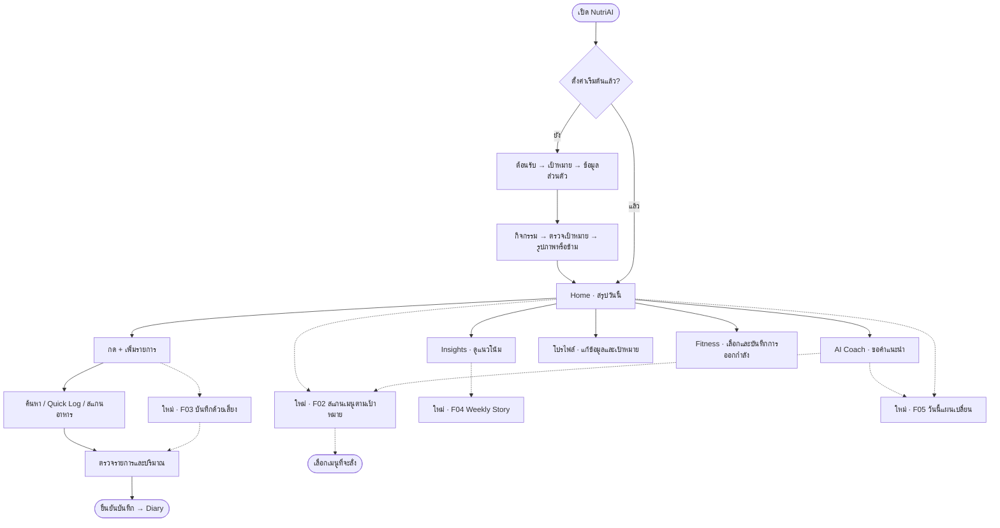
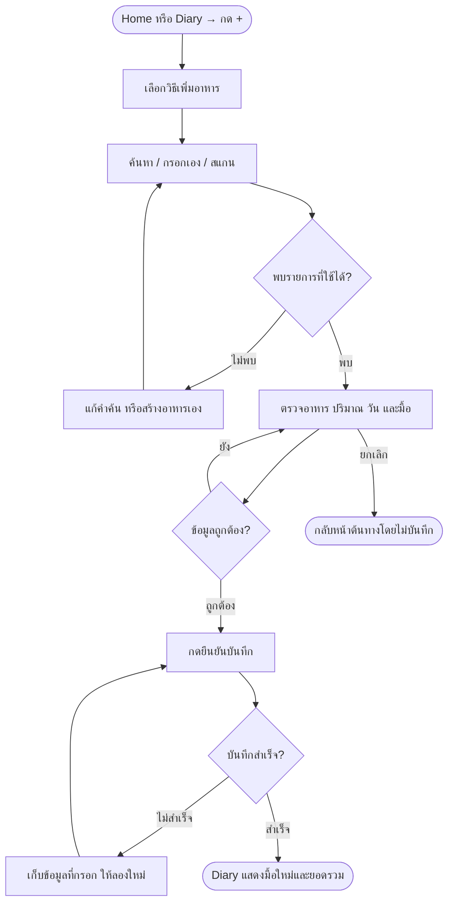
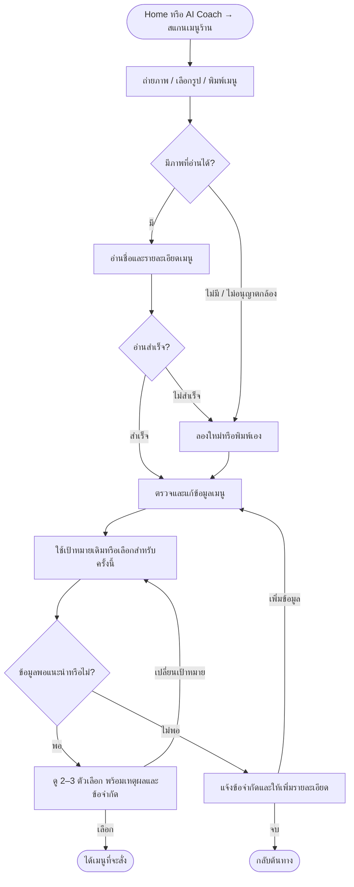
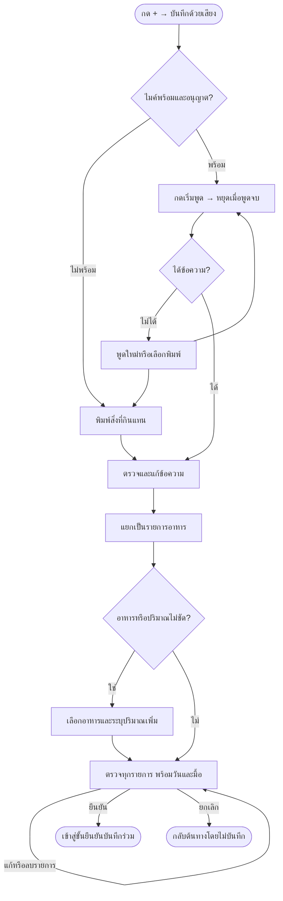
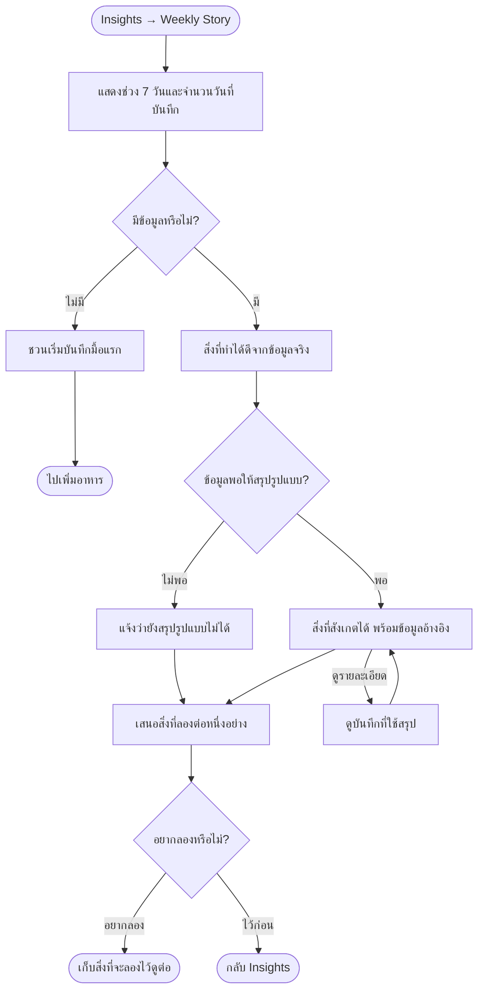
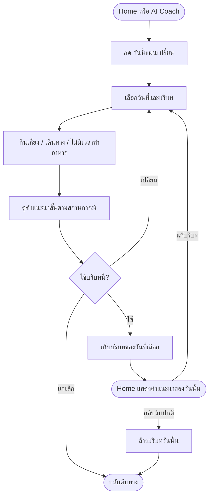
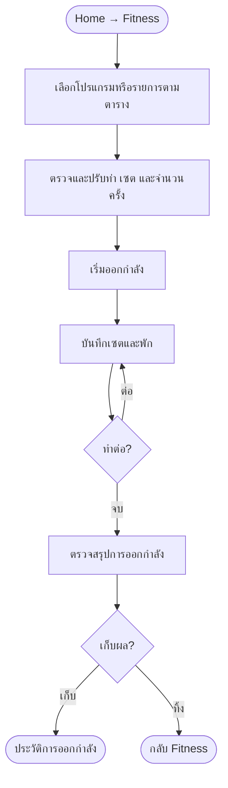
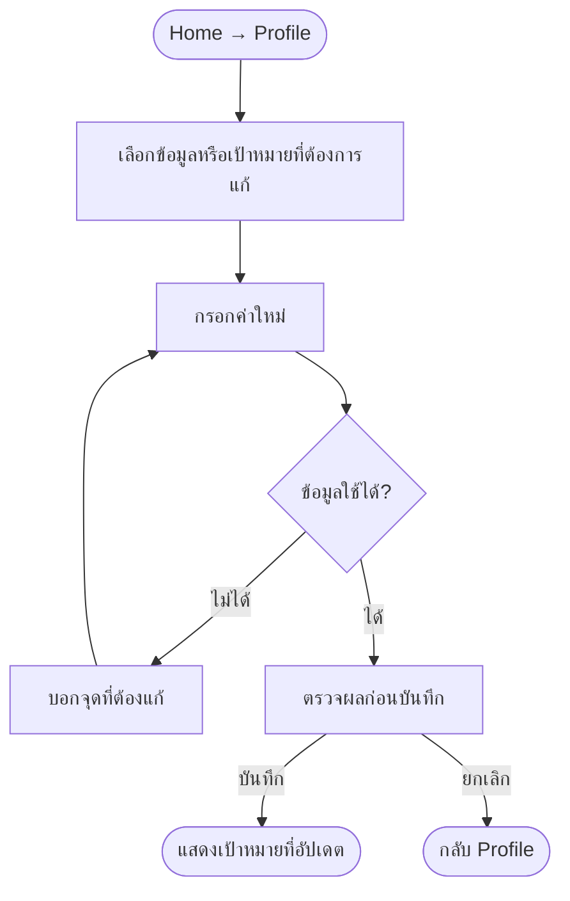
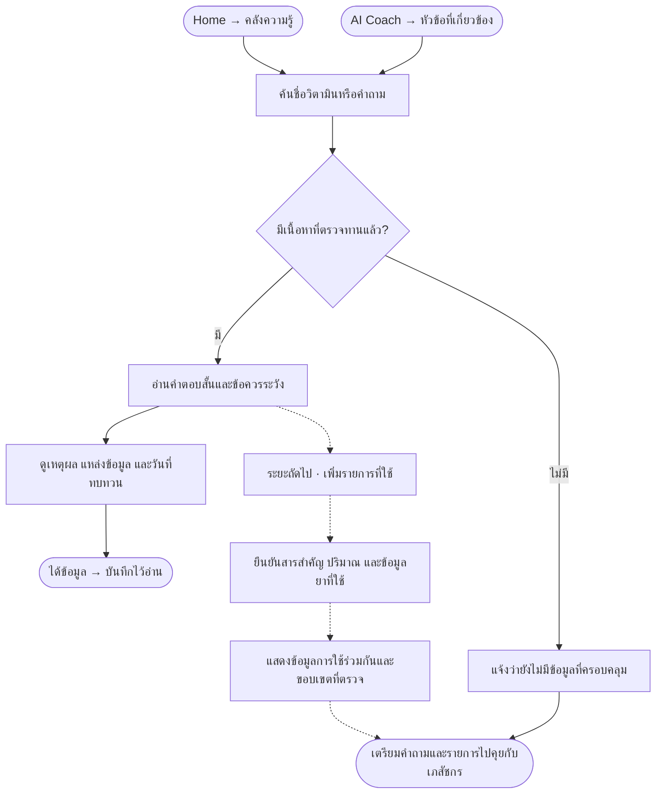

# NutriAI — User Flow Design

วันที่ 16 กันยายน 2026 • แบบเสนอสำหรับออกแบบและพัฒนา ไม่ใช่สถานะระบบที่เสร็จแล้ว

อ้างอิง: [Figma — What is a user flow?](https://www.figma.com/resource-library/user-flow/)
ใช้หลักหนึ่งเป้าหมายต่อ flow พร้อมจุดเริ่ม การกระทำ ทางเลือก และผลลัพธ์ที่ชัดเจน

กลุ่มผู้ใช้สมมติ: คนที่ต้องการดูแลการกินในชีวิตประจำวันและบันทึกได้รวดเร็ว ต้องทดสอบกับผู้ใช้จริงต่อ

สัญลักษณ์: มุมมน = เริ่ม/จบ, กล่อง = หน้าจอหรือการกระทำ, ข้าวหลามตัด = ตัดสินใจ, เส้นประ = ส่วนต่อยอดที่วางแผนไว้
โครงหลักอิงหน้าจอในโปรเจกต์ ส่วน F02–F05 เป็นฟีเจอร์ใหม่; ไอเดีย N01–N05 ยังไม่รวมในขอบเขตนี้

## 1. ภาพรวมเส้นทางหลัก

คงแถบหลัก Home / Diary / + / Insights / AI Coach ส่วน Fitness และ Profile เป็นเส้นทางรองจาก Home ตามแบบนี้ ไม่เพิ่มแท็บเพื่อรองรับทุกฟีเจอร์ สแกนอาหารเดิมยังมีส่วนต้นแบบ

## 2. บันทึกอาหาร — เส้นทางร่วม

เป้าหมาย: บันทึกสิ่งที่กินได้ถูกวัน ถูกมื้อ และตรวจแก้ได้

## 3. F02 — สแกนเมนูร้านเพื่อช่วยเลือกตามเป้าหมาย [ใหม่]

เป้าหมาย: ช่วยเลือกเมนูที่น่าจะเหมาะกับการลดไขมัน เพิ่มกล้ามเนื้อ หรือเป้าหมายที่ผู้ใช้เลือก จบเมื่อได้เมนูที่จะสั่ง ไม่มีขั้นบันทึกแคลอรีหรือถ่ายอาหารซ้ำ

คำแนะนำอิงข้อมูลที่อ่านได้และข้อมูลประกอบที่ตรวจสอบได้ ไม่ฟันธงโปรตีนสูงหรือไขมันต่ำจากภาพอย่างเดียว หากรองรับได้ไม่ถึง 2–3 เมนูให้เสนอเฉพาะที่มีข้อมูล ไม่มีการประมาณน้ำหนักหรือสร้างตัวเลขแคลอรีใน flow นี้ ไม่เพิ่มรายการใน Diary ไม่ต้องยืนยันว่ากินแล้ว ผู้ใช้ยกเลิกกลับต้นทางได้ทุกขั้น การเปลี่ยนเป้าหมายครั้งนี้ไม่แก้เป้าหมายหลัก

## 4. F03 — บันทึกด้วยเสียง [ใหม่]

เป้าหมาย: พูดหนึ่งครั้งแล้วตรวจรายการทั้งหมดก่อนบันทึก

หยุดไมค์เมื่อออกจากหน้า ไม่เริ่มฟังเอง เมื่อแยกข้อความไม่ได้ให้กรอกผ่าน Quick Log ได้ ป้องกันการบันทึกซ้ำจากการกดยืนยันหลายครั้ง

## 5. F04 — Weekly Story [ใหม่]

เป้าหมาย: เข้าใจสิ่งที่เกิดขึ้นในสัปดาห์และเลือกสิ่งเล็ก ๆ ที่จะลองต่อ

เกณฑ์ข้อมูลเพียงพอเป็นกฎที่ต้องกำหนดและทดสอบรายข้อสังเกต ไม่ใช้วันว่างเป็นศูนย์ ไม่สรุปเหตุและผล เป้าหมายที่เลือกเป็นกิจกรรมสมัครใจ ไม่แก้เป้าหมายสารอาหารอัตโนมัติ

## 6. F05 — วันนี้แผนเปลี่ยน [ใหม่]

เป้าหมาย: ได้คำแนะนำที่เข้ากับสถานการณ์วันนี้โดยไม่รู้สึกผิด

วันใหม่ใช้บริบทของวันใหม่ ไม่สืบต่อเอง ไม่เปลี่ยนเป้าหมายอาหารหรือแนะนำการชดเชย

## 7. Fitness — ทำและบันทึกการออกกำลัง

## 8. Profile — ปรับเป้าหมาย

## ข้อตกลงสำหรับออกแบบหน้าจอต่อ

- ทุก flow มีปุ่มกลับและยกเลิกที่ไม่สร้างรายการอาหารเอง
- ขอสิทธิ์กล้องหรือไมค์เฉพาะเมื่อใช้วิธีนั้น และมีทางเลือกพิมพ์
- จุดยืนยันบันทึกเป็นรูปแบบเดียวกันทุกช่องทาง
- การเลือกเมนูที่จะสั่งไม่เท่ากับการกินแล้ว
- ข้อมูลผิดพลาดต้องแก้ได้โดยไม่ต้องเริ่มทั้ง flow ใหม่
- ยังไม่เพิ่มระบบสมัครสมาชิก การแจ้งเตือน หรือการเชื่อมบริการภายนอกที่ผู้ใช้ไม่ได้เลือก
- ทดสอบกับผู้ใช้: บันทึกมื้อแรก, ไมค์ถูกปฏิเสธ, เมนูอ่านไม่ออก, สัปดาห์ไม่มีข้อมูล, เปลี่ยนบริบทแล้วกลับวันปกติ

## 9. F06 — Library [แบบเสนอใหม่]

เป้าหมาย: ได้คำตอบเกี่ยวกับอาหารเสริมพร้อมเข้าใจข้อจำกัดของข้อมูล รุ่นแรกเน้นความรู้ที่ตรวจทานแล้ว รุ่นตรวจรายการร่วมกันเป็นงานระยะถัดไป

ผลตรวจต้องไม่ตีความการไม่พบข้อมูลว่าเป็นการรับรองความปลอดภัย ไม่ปรับยาและอาหารเสริมอัตโนมัติ
